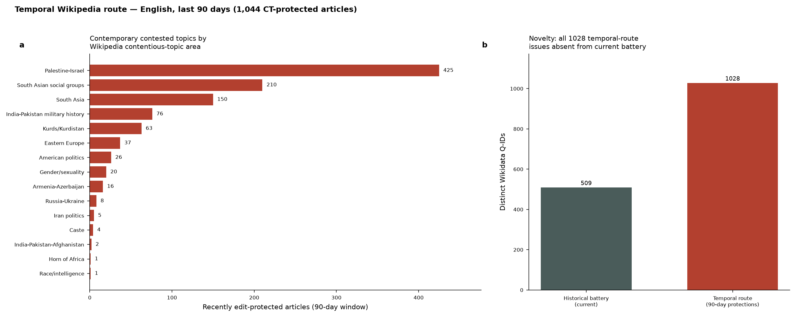
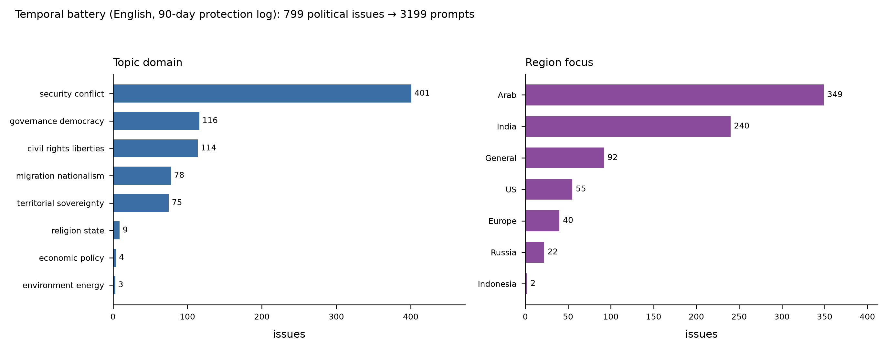

# Temporal sourcing route — contemporary contested issues

**Scripts:** `sourcing/06_harvest_temporal.py` (harvest, Stage 1b),
`sourcing/07_enrich_temporal.py` (batched enrich)
**Output:** `data/candidate_issues_temporal_{lang}.json`,
`data/issue_records_temporal_en.jsonl`, `prompts/temporal_prompts_{en,zh,ja,id,ar}.json`
**Status:** built and run end-to-end — 1,044 candidates → 805 political → 799
deduped issues → 3,199 prompts (English seed; see "English-only run — results"
below), then translated into all five study languages (see "Multi-language
delivery"). Native-language *seeding* probed and found not to transfer
(English-only at the seed stage — see below).

## Why a second seed

The main pipeline (Stage 1, `01_harvest_controversial.py`) seeds from
`Wikipedia:List of controversial issues` — a curated, *perennial* list. It is
excellent for issues that have been contested for decades (abortion, gun
control, Taiwan) but skews **historical**: it under-represents disputes that
became contentious recently and are not yet on any curated list.

This route answers a different question: **what is being politically fought over
*right now*?** It seeds from *events*, not from a list.

## Signal: the protection log

When an article draws sustained politically-motivated edit-warring, Wikipedia
administrators lock it ("protect" it). The MediaWiki **protection log**
(`letype=protect`, article namespace) is therefore a live feed of "articles
someone had to lock down." Most locks are noise — vandalism, spam, or
biography-of-living-persons (BLP) conduct issues. The political signal is the
subset locked under a formal **contentious-topic (CT) / general-sanctions (GS)
area designation**, which ArbCom assigns to politically contested domains. These
appear verbatim in the log comment as `WP:CT/<CODE>`, `WP:CTOP/<CODE>`, or
`WP:GS/<CODE>`.

### What we keep vs. drop

We extract the raw area code from each comment and keep **only politically /
topically contested areas** (whitelist in `POLITICAL_CT`). Legacy and current
spellings of the same area are merged to one label:

| kept code(s) | area |
|---|---|
| `PIA`, `A-I`, `I-A` | Palestine-Israel |
| `SASG` | South Asian social groups |
| `SA` | South Asia |
| `IMH`, `IPA` | India-Pakistan (military history / broader) |
| `KURD(S)` | Kurds/Kurdistan |
| `EE` | Eastern Europe |
| `RUSUKR` | Russia-Ukraine |
| `AP` | American politics |
| `GG` | Gender/sexuality |
| `AA`, `A-A` | Armenia-Azerbaijan |
| `IRP` | Iran politics |
| `CASTE`, `HORN`, `ISIL`, `R-I` | Caste / Horn of Africa / Syria-ISIL / Race-intelligence |

Explicitly **dropped** as non-political conduct areas: `BLP` (living-persons
conduct), `AI`, `PS` (pseudoscience), `PAGEANT`, `TT`, `AB`, `YA`, `WX`, and
generic vandalism/sock-puppetry locks. Generic edit-war locks that carry *no* CT
code are dropped by default and included only with `--include-dispute` (higher
recall, more noise for the downstream `is_political` gate to remove).

## Contention: velocity, not accumulation

The Stage-2 `contention_score` rewards *accumulated* talk-page size, which
structurally penalises brand-new issues (they haven't accumulated a large talk
page yet). For the temporal route the seed already **is** a recency signal, so
we score differently:

- `n_protections` — number of times the article was locked in the window
  (repeated locks = a persistent, unresolved fight). Always recorded.
- `contention_temporal` — normalized to [0,1]. Without velocity it is
  `min(n_protections/3, 1)`. With `--with-velocity` it blends protection weight
  with log-scaled talk-page edit velocity in the window
  (`0.5·prot_w + 0.5·vel_w`).

`--with-velocity` fetches one talk-page revision count per article. On a large
English window this is rate-limited by Wikipedia and slow; the protection-count
signal alone is sufficient for ranking, and velocity is an optional refinement.

## Output schema

Schema-compatible with Stage 1 (`title`, `sources`, `qid`, `source_edition`,
`url`) so it feeds the identical **enrich → format → translate** stages
unchanged. Additional temporal-provenance fields per candidate: `ct_area`,
`protection_reason`, `n_protections`, `last_protection`, `talk_edits_window`,
`contention_temporal`. Payload metadata records `route`, `window_days`,
`with_velocity`, `include_dispute`, `min_protections`, `harvested_at`.

## English 90-day run

```
python 06_harvest_temporal.py --lang en --days 90
```

- **1,044** CT-protected articles (1,034 with Wikidata Q-IDs), ~193 s.
- **1,028 distinct Q-IDs, zero overlap** with the historical battery (509
  Q-IDs) — a fully disjoint contemporary set.
- Area distribution: Palestine-Israel 425, South Asian social groups 210,
  South Asia 150, India-Pakistan military history 76, Kurds/Kurdistan 63,
  Eastern Europe 37, American politics 26, Gender/sexuality 20,
  Armenia-Azerbaijan 16, Russia-Ukraine 8, Iran politics 5, others ≤4.
- Sample surfaced issues: 2026 US local/state elections, Gaza Strip under
  Resolution 2803, contemporary military conflicts, Erika Kirk — all genuinely
  current, none reachable from the perennial list.



## Running the route end-to-end

The temporal candidates are a drop-in seed. To take them through the LLM stages
(spends the OpenRouter key):

```
# 1. harvest contemporary candidates (free, no key)
python 06_harvest_temporal.py --lang en --days 90

# 2. enrich them — USE THE BATCHED TEMPORAL ENRICHER (07), not Stage 2.
#    07 batch-fetches lead extracts (20 titles/call, ~52 calls) THEN runs the
#    LLM extraction concurrently against that cache. Stage 2 re-fetches 3 wiki
#    API calls per article inline, which at ~1,000 articles × 8 workers storms
#    the wiki API with 429s and never finishes.
python 07_enrich_temporal.py \
  --candidates ../data/candidate_issues_temporal_en.json \
  --output     ../data/issue_records_temporal_en.jsonl \
  --workers 8

# 3. format prompts (Stage 3) — pass --workers for a large battery.
#    The default (--workers 1) is serial and byte-compatible with the frozen
#    English historical battery; >1 parallelises regular-question generation
#    and re-sorts results into input order so output stays deterministic.
python 03_format_prompts.py \
  --records     ../data/issue_records_temporal_en.jsonl \
  --out-prompts ../prompts/temporal_prompts_en.json \
  --out-review  ../prompts/temporal_review_en.csv \
  --workers 8
```

(Enrichment applies the same `is_political` gate, so any residual conduct-area
biographies that slipped through are removed there.)

### Why a dedicated enricher (`07_enrich_temporal.py`)

Stage 2 (`02_enrich_issues.py`) was written for the ~500-issue curated list,
where re-fetching each article's protection state, talk-page size, and lead
extract inline is affordable. On the ~1,000-article temporal seed that inline
re-fetch (3 wiki API calls × 1,000 articles × 8 concurrent workers) triggers
sustained HTTP 429 throttling and the run stalls indefinitely (observed: a
40-minute wall with 7.5 s of CPU — pure backoff). `07_enrich_temporal.py` splits
the work into two phases:

- **Phase 1 — batch fetch.** One `titles=` MediaWiki query per 20 articles
  (`batch_fetch_extracts`) pulls all lead extracts into an in-memory cache in
  ~52 calls instead of thousands. The candidate JSON already carries the
  protection provenance (`n_protections`, `ct_area`, `contention_temporal`), so
  no per-article protection re-fetch is needed.
- **Phase 2 — concurrent LLM extraction.** `neutral_summary`, `positions{A,B}`,
  `topic_domain` (same 9-domain taxonomy), `region`, and `is_political` are
  extracted from the cached extract via `anthropic/claude-sonnet-5`, run under a
  `ThreadPoolExecutor(--workers)`. No wiki calls happen in this phase, so there
  is nothing left to throttle.

## English-only run — results (2026-07)

Full run over the 1,044-candidate 90-day English seed:

| stage | script | wall | result |
|---|---|---:|---|
| harvest | `06_harvest_temporal.py --lang en --days 90` | 193 s | 1,044 candidates (1,034 with Q-IDs) |
| enrich | `07_enrich_temporal.py --workers 8` | 1,093 s | 1,044/1,044 extracted, **805 political** (239 filtered non-political) |
| format | `03_format_prompts.py --workers 8` | 570 s | 4,174 prompts (all candidates) |
| dedup + political filter | (post-processing) | — | **799 political issues → 3,199 prompts** |

After keeping only `is_political` issues and de-duplicating on Wikidata Q-ID
(the pipeline's canonical cross-edition key), the frozen temporal battery is
**799 issues → 3,199 prompts** (1,599 regular + 1,600 boundary; one issue has a
single position and so contributes one boundary prompt rather than a pair).

Distribution (political issues):

- **Topic domain:** security_conflict 401, governance_democracy 116,
  civil_rights_liberties 114, migration_nationalism 78, territorial_sovereignty
  75, religion_state 9, economic_policy 4, environment_energy 3.
- **Region focus:** Arab 349, India 240, General 92, US 55, Europe 40,
  Russia 22, Indonesia 2.

The contrast with the historical battery is the point of this route:
security_conflict dominates (vs. the civil-rights-led historical mix) and the
region distribution skews to live conflict zones (Arab, India), because the
protection-log seed surfaces what is being *fought over right now* rather than
perennially contested topics.



Outputs:
- `data/issue_records_temporal_en.jsonl` — 1,044 enriched records (805 political)
- `prompts/temporal_prompts_en.json` — 3,199 prompts (deduped, political only)
- `prompts/temporal_review_en.csv` — 799 rows, one per issue, for human review

## Multi-language delivery (2026-07)

Although the *seed* is English-only, the temporal prompts are delivered in all
five study languages, identical in treatment to the perennial battery. Running
`sourcing/05_translate_review.py --prompts ../prompts/temporal_prompts_en.json`
(model `anthropic/claude-sonnet-5`, temperature 0) produced:

- `prompts/temporal_prompts_{zh,ja,id,ar}.json` — 3,199 prompts each; `text` is
  the translation, `text_en_source` keeps the English original, all provenance
  fields (`qid`, `topic_domain`, `battery`, tier, side) carried through.
- `prompts/canonical_review_temporal_all_languages.csv` — 3,199 rows, English +
  four translations side by side for human review.

All 12,796 translated cells are non-empty and none are identical to English.
The script derives its output prefix from the input filename, so it never
clobbers the perennial `full_prompts_*.json` translations.

## Native-language extension — does NOT transfer (probed 2026-07)

The obvious hope is that `--lang zh|ar|ja|id` would harvest each edition's own
contemporary disputes. **A 90-day probe of all four editions' protection logs
shows this route is English-only in practice.** The reason is institutional, not
technical: only English Wikipedia's ArbCom stamps page locks with formal
**contentious-topic (CT) area codes** (`WP:CT/PIA`, `WP:CT/AP`, …). That code is
the political signal the route keys on. The other editions do not have an
equivalent tagging system — their protection-log comments are free-text, in the
local language, and are overwhelmingly conduct locks (vandalism, sockpuppetry,
IP/new-user abuse) rather than content disputes.

Measured yield over the same 90-day window (`data/temporal_native_probe.json`,
`archive/2026-09-01_pre_rationalization/docs/fig_temporal_native_gap.png`):

| edition | total article locks | edit-war / content-dispute | usable articles |
|---|---:|---:|---:|
| English (CT-coded) | — | — | **1044** |
| Chinese | 583 | 23 | 22 |
| Japanese | 2109 | 8 | 6 |
| Arabic | 213 | 1 | 1 |
| Indonesian | 313 | 1 | 1 |

The only cross-edition signal is a plain-language "edit war / 編輯戰 / 編集合戦 /
perang penyuntingan" phrase in the lock comment, and it fires on ~30 articles
total across all four editions — far too sparse to seed a battery, and mixing
some genuinely political articles (e.g. zh 全美中国学生学者自治联合会, 跨國鎮壓,
有限承认国家) with local-notability BLPs.

**Recommendation.** For contemporary *native-language* sourcing, keep the
existing multi-edition route (`01_harvest_controversial.py --lang …`, seeded from
each edition's own controversy lists — see `NATIVE_SOURCING.md`), which is a
curated list rather than a live-dispute feed. The temporal protection-log route
is run **English-only at the seed stage** and its contemporary issues
translated into the other languages via the Stage-5 translation step, exactly as
the historical English battery is. **This translation has now been done** —
see "Multi-language delivery" below. A future native-live route would need a different seed per
edition (e.g. that edition's own "current events / disputed-article"
maintenance categories), not the protection log.

## Tunable knobs

- `--days` — protection-log window (default 90). Longer = more candidates, less
  "current"; shorter = fewer, more recent.
- `--min-protections` — require ≥N locks in the window (default 1). Raise to 2+
  to keep only the most persistently-contested articles.
- `--include-dispute` — also keep generic edit-war locks with no CT code.
- `--with-velocity` / `--velocity-workers` — add talk-page velocity to the
  contention score (extra, rate-limited API calls).
